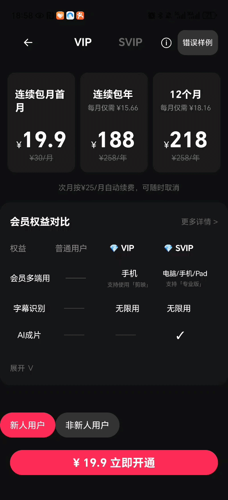
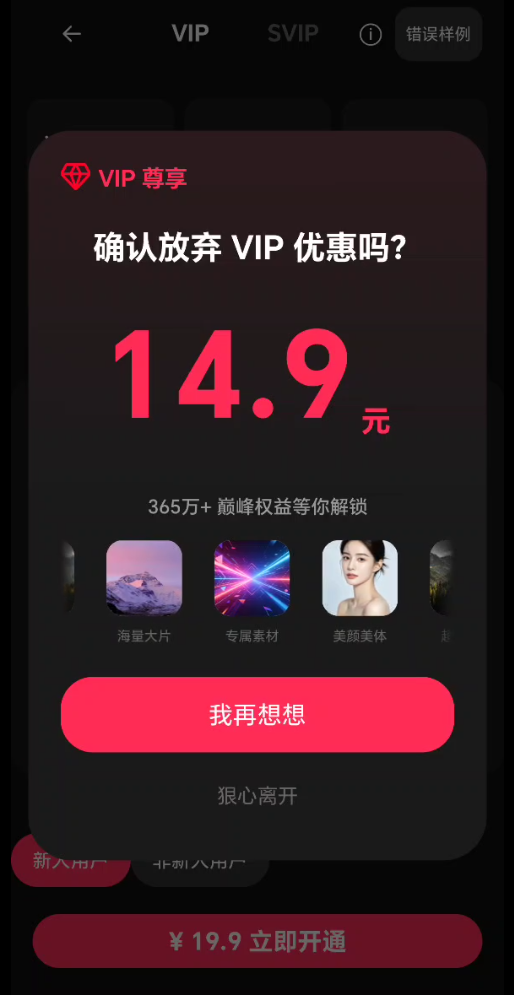
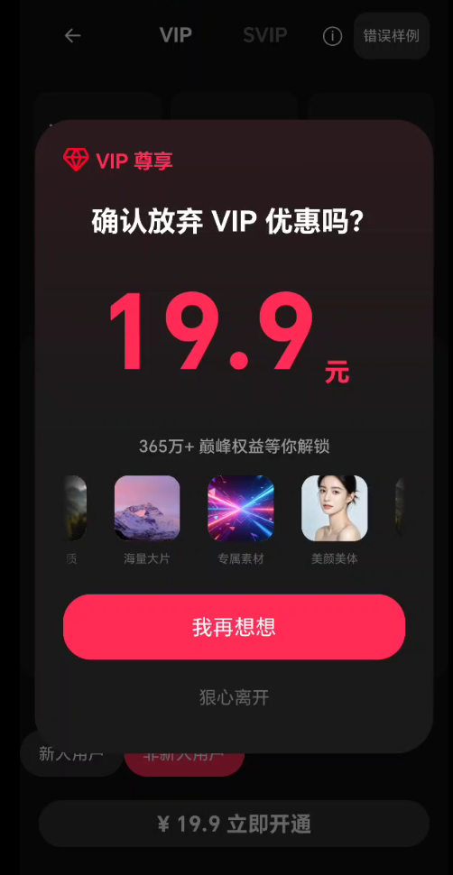
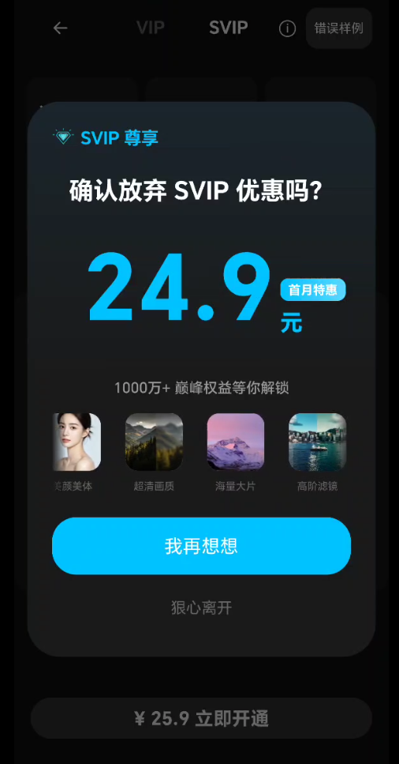

# 项目概述

​	本项目是一款基于DSL（领域特定语言）的跨平台动态UI渲染框架，核心技术栈依托KMP（Kotlin Multiplatform）跨平台架构搭建，搭配Jetpack Compose完成原生UI渲染，实现Android、iOS多端核心业务逻辑、解析能力与UI规则的高度复用。框架脱离原生代码硬编码限制，通过标准化JSON DSL协议统一描述页面布局、样式、组件属性、交互逻辑、状态管控与动效能力，搭配表达式引擎实现动态数据绑定与条件决策，完整支撑UI页面的动态配置、实时更新、差异化展示，高效适配多变的业务营销场景，大幅降低多端UI迭代成本、提升业务落地效率。

# **选择场景**：**剪映订阅挽留**

**为什么选择它？**

*   该场景需要吸引眼球的动效（价格跳动、入场动画）。
*   订阅挽留页面的权益描述、价格策略等需要根据不同的活动快速调整。
*   挽留弹窗需要根据不同用户的身份或者其他场景来展示差异化的文案与按钮逻辑。

# 实现效果

动画特效



vip新人订阅挽留页面



vip非新人订阅挽留页面



svip订阅挽留页面



# DSL 页面能力

###  已支持能力：
*   实现了 `style` (盒模型)、`props` (组件特有属性)、`state` (生存状态) 的彻底分离，支持高度自定义的 UI 展现。
*   拥有多种特化动效。
*   基于KMP实现协议层逻辑共享。
*   内置表达式引擎，支持路径读取及实时三元运算决策。
*   具备校验机制和降级机制，将未知组件降级为 `UnknownNode` 。

### 目前不支持的能力：
*   目前主要侧重于展示和点击，不支持实时输入校验。
*   目前动画主要作用于单个组件内部，暂不支持两个独立节点之间的物理碰撞或复杂的关联手势动画。

------

# UI_DSL设计

## DSL 节点

```
{
  "type": "组件类型",    // 必填: Column | Row | Box | Text | Image | Button
  "id": "唯一ID",       // 可选
  "style": { ... },           // 可选: 通用样式
  "children": [ ... ],        // 仅容器组件有(Column/Row/Box): 子节点列表
  "props": { ... },           // 可选: 组件特有属性
  "state": { ... },           // 可选: 生存状态属性
  "action": { ... }           // 可选: 交互行为属性
}
```

------

## 节点下style字段

```
"style": {
  // 布局尺寸
  "width": "match_parent",           // match_parent | wrap_content | 300.0 (dp数值使用字符串)
  "height": "wrap_content",          // 同上

  // 边距
  "padding": {                       // 内边距, 单位 dp
    "top": 16,
    "bottom": 16,
    "left": 20,
    "right": 20
  },
  "margin": {                        // 外边距, 单位 dp
    "top": 8,
    "bottom": 8,
    "left": 0,
    "right": 0
  },

  // 背景
  "backgroundColor": "#FFFFFF",      // #RRGGBB 或 #AARRGGBB (优先级低于 backgroundGradient)
  "backgroundGradient": {            // 渐变色，优先级高于 backgroundColor
    "direction": "vertical",         // vertical | horizontal | diagonal
    "colors": ["#1A1A2E", "#2D2D44"]
  },

  // 圆角
  "borderRadius": 12,                // 圆角, 单位 dp (支持数字或四个角独立对象)

  // 子元素在其父容器内的对齐方式
  "alignment": "center"              // Column: start|center|end 
                                     // Row: top|center|bottom 
                          // Box: "center" | "top-left" | top-right" | "bottom-left" |"bottom-right"
}
```

------

## 节点下props字段

### Text

```
"props": {
  "text": "Hello World",           // 文字内容
  "fontSize": 16,                  // 字号, 单位 sp
  "textColor": "#333333",          // 文字颜色, #RRGGBB
  "fontWeight": "bold",            // normal | medium | bold
  "textDecoration": "underline",   // line-through | underline
  "lineHeight": 24                 // 行高, 单位 sp
}
```

### Button

```
"props": {
  "text": "string",                  // 按钮文字
  "fontSize": 14,                 // 字号(sp)
  "textColor": "#FFFFFF"          // 文字颜色
  "icon": "res://ic_check",         // 可选: 图标地址
}
```

### Image

```
"props": {
  "url": "https://example.com/photo.jpg",  // 图片地址
  "contentScale": "crop"                   // crop | fit | fill（裁剪 | 适应 | 拉伸填充）
}
```

------

## 节点下animation字段

```
 "animation":{
  	"enter": {  			// 入场动画（组件首次出现时）
  		// 动画定义对象（核心结构）
    	"type": "fadeIn",        // 动画类型 [必填] 
    						   // [fadeIn | scaleIn | slideInUp | slideInDown | NumRolling]
    						   
  	  	"duration": 300,         // 动画时长(ms) [可选]
      	"delay": 0,              // 延迟开始时间(ms) [可选]
      	"easing": "linear",     // 缓动曲线 [可选]。[linear | easeIn | easeOut | easeInOut]
      	"repeatCount": 0,        // 重复次数 [可选]。[0=不重复，-1=无限循环]
      	"repeatMode": "restart", // 重复模式 [可选]。[restart | reverse]
    },        
  	"exit": { ... },         // 退场动画[可选]（组件移除时）[先不做]
  	"onTap": { ... },        // 点击动画[可选]（交互反馈）[先不做]
  	"loop": { ... }          // 循环动画[可选]（持续播放，如加载转圈）
  },
  
  "animation": {
  	"loop": {
    	"type": "marquee", // 轮播
    	"props": {
      		"pauseOnTouch": true,  // 触摸/鼠标悬停时是否暂停
      		"direction": "left"    // 预留方向控制
    		}
  		}
	}
```

------

## 节点下state字段

```
"state": {
  "visible": "{isLoggedIn}",       // 布尔值或表达式，控制显隐
  "enabled": true                  // 是否可交互
}
```

------

## 节点下action字段

```
"action": {
  "onTap": {                               // 触发方式：点击事件
    "type": "navigate",                    // 动作类型：页面跳转
      // 可选值: navigate(跳转) | back(返回) | dismiss(关闭) | showToast(提示) | custom(自定义)
    
    "target": "capcut://member_center",    // 跳转目标URL
  }
}
```

------

## DSL设计总结

```
{
  // 基础节点结构  
  {
    "type": "Unknown", 组件基础身份定义[必填]。[Box | Column | Row | Text | Image | Button | Unknown]
    "id": "", 唯一识别码[可选]
    "style": "...", 定义组件的视觉属性[可选] [盒模型样式层]
    "props": "...", 定义组件的特有属性[可选] [业务属性层]
    "state": "...", 控制组件在运行时的生存状态[可选] [逻辑状态层]
    "animation":"..." 定义组件的动画效果[可选] [动效表现层]
    "action": "...", 定义用户操作后触发的指令映射[可选] [交互行为层]
    "children": "..." 存放当前容器组件内部包含的子节点列表[可选] [结构嵌套层]
  },
  
 // 盒模型样式层
  "style": {
    "width": "wrap_content", // 控件宽度[可选]。[match_parent | wrap_content | 具体数字(dp)]
    "height": "wrap_content", // 控件高度[可选]。[match_parent | wrap_content | 具体数字(dp)]
    "backgroundColor": "Transparent", // 背景填充颜色[可选]。[#RRGGBB | #AARRGGBB | Transparent(透明)]
    "backgroundImage": "", // 背景图片[可选]。[网络URL | res://本地资源]
    
    "borderRadius": 0, // 盒子的圆角弧度[可选]。
    				 // [数字(dp) | 对象{top-left,top-right,bottom-left,bottom-right}]
    				 
    "padding": 0, // 组件内边距[可选]。[数字 | 对象{top,right,bottom,left}]
    "margin": 0, // 组件外边距[可选]。[数字 | 对象{top,right,bottom,left}]
    
    "alignment": "center", // 对齐策略[可选]。
    					// [Column: start | center | end] 
                          // [Row: top | center | bottom] 
                          // [Box:  center
                          //	 top-left | top-center | top-right | 
                          //	 bottom-left | bottom-center| bottom-right]
    
    "weight": "0.0" // 布局权重[可选]。[浮点数字符串, 如 "1.0"]
  },

  // 业务属性层
  "props": {
    "Text": {
      "text": "Missing Text", // 显示的文字内容[必填]
      "fontSize": "14", // 文本的字号大小(sp)[可选]
      "textColor": "", // 文本的颜色值[可选]。
      "fontWeight": "normal", // 文字的粗细程度[可选]。[normal | medium | bold]
      "textDecoration": "none", // 文字修饰效果[可选]。[none | underline | line-through]
      "lineHeight": 0 // 文本的行高[可选]。[数字(sp)]
    },
    
    "Image": {
      "url": "", // 图片的获取来源[必填]。[URL | res://资源名]
      "contentScale": "fit", // 图片的缩放适配模式[可选][crop(裁剪) | fit(适应) | fill(拉伸)]
    },
    
    "Button": {
      "text": "", // 按钮上显示的标签文字[必填]。
      "fontSize": 16, // 按钮文字的大小[可选]。[数字(sp)]
      "textColor": "#FFFFFF", // 按钮文字的颜色[可选]。[十六进制格式]
      "icon": "", // 按钮文字旁的图标路径[可选]。[res://资源名]
    },
    
    "Column": {
      "spacing": 0 // 容器内子组件之间的固定间距[可选]。[数字(dp)]
    },
    
    "Row": {
      "spacing": 0 // 容器内子组件之间的固定间距[可选]。[数字(dp)]
    }
  },
  
  // 动效表现层
  "animation":{
  	"enter": {  			// 入场动画（组件首次出现时）
  		// 动画定义对象（核心结构）
    	"type": "fadeIn",        // 动画类型 [必填] 
    						   // [fadeIn | scaleIn | slideInUp | slideInDown | numRolling]
    						   
  	  	"duration": 300,         // 动画时长(ms) [可选]
      	"delay": 0,              // 延迟开始时间(ms) [可选]
      	"easing": "linear",     // 缓动曲线 [可选]。[linear | easeIn | easeOut | easeInOut]
      	"repeatCount": 0,        // 重复次数 [可选]。[0=不重复，-1=无限循环]
      	"repeatMode": "restart", // 重复模式 [可选]。[restart | reverse]
    },        
  	"exit": { ... },         // 退场动画[可选]（组件移除时）[未做]
  	"onTap": { ... },        // 点击动画[可选]（交互反馈）[未做]
  	"loop": {				// 循环动画[可选]
         "type": "marquee", // 动画类型 [必填] [marquee]
         "duration": 3000,
         "props": {
         "pauseOnTouch": true,
         "direction": "left"
         }
   }          
  },
  
  // 逻辑状态层
  "state": {
    "visible": "true", // 控制组件是否在屏幕上渲染[可选]。[true | false]
    "enabled": true // 控制组件是否允许交互[可选]。[true | false]
  },
  
  // 交互行为层
 "action": {
    "onTap": {...}, // 用户点击时触发的指令[可选]。[动作对象 | 动作对象数组]
    // onTap内部结构
    {
      "type": "id", // 动作的分类指令[必填]。[navigate(跳转) | back | dismiss | showToast | id]
      "target": "" // 动作的目标参数[可选]。[路径URL | Toast文本 | 动作ID] 
    }
  }
}
```


# DSL 组件描述规范

### 一、基础节点结构

| 字段      | 类型   | 默认值  | 说明                                                         |
| :-------- | :----- | :------ | :----------------------------------------------------------- |
| type      | string | Unknown | 组件类型。可选值：`Box`、`Column`、`Row`、`Text`、`Image`、`Button`、`Unknown` |
| id        | string | 空      | 组件唯一标识符                                               |
| style     | object | -       | 视觉属性定义                                                 |
| props     | object | -       | 组件特有属性                                                 |
| state     | object | -       | 运行时状态控制                                               |
| animation | object | -       | 动画效果定义                                                 |
| action    | object | -       | 交互行为定义                                                 |
| children  | array  | -       | 子组件列表                                                   |

------

### 二、style

| 字段            | 类型          | 默认值       | 说明                                                         |
| :-------------- | :------------ | :----------- | :----------------------------------------------------------- |
| width           | string        | wrap_content | 宽度。可选值：`match_parent`、`wrap_content`、具体数字(dp)   |
| height          | string        | wrap_content | 高度。可选值：`match_parent`、`wrap_content`、具体数字(dp)   |
| backgroundColor | string        | Transparent  | 背景颜色。可选值：`#RRGGBB`、`#AARRGGBB`、`Transparent`      |
| backgroundImage | string        | 空           | 背景图片。可选值：网络URL、`res://`本地资源                  |
| borderRadius    | number/object | 0            | 圆角弧度。可填数字(dp) 或对象 `{top-left, top-right, bottom-left, bottom-right}` |
| padding         | number/object | 0            | 内边距。可填数字或对象`{top, right, bottom, left}`           |
| margin          | number/object | 0            | 外边距。可填数字 或 对象`{top, right, bottom, left}`         |
| alignment       | string        | center       | 对齐策略。根据父容器类型有不同可选值（见下表）               |
| weight          | string        | 0.0          | 布局权重，浮点数字符串，如 `"1.0"`                           |

alignment 可选值（按容器类型）

| 容器类型 | 可选值                                                       |
| :------- | :----------------------------------------------------------- |
| Column   | `start`、`center`、`end`                                     |
| Row      | `top`、`center`、`bottom`                                    |
| Box      | `center`、`top-left`、`top-center`、`top-right`、`bottom-left`、`bottom-center`、`bottom-right` |

------

### 三、Props

Text 组件

| 字段           | 类型   | 默认值         | 说明                                                  |
| :------------- | :----- | :------------- | :---------------------------------------------------- |
| text           | string | "Missing Text" | 显示的文字内容                                        |
| fontSize       | string | "14"           | 字号大小(sp)                                          |
| textColor      | string | 空             | 文本颜色值                                            |
| fontWeight     | string | "normal"       | 文字粗细。可选值：`normal`、`medium`、`bold`          |
| textDecoration | string | "none"         | 文字修饰。可选值：`none`、`underline`、`line-through` |
| lineHeight     | number | 0              | 行高(sp)                                              |

Image 组件

| 字段         | 类型   | 默认值 | 说明                                          |
| :----------- | :----- | :----- | :-------------------------------------------- |
| url          | string | 空     | 图片来源。可选值：网络URL、`res://`本地资源名 |
| contentScale | string | "fit"  | 缩放适配模式。可选值：`crop`、`fit`、`fill`   |

Button 组件

| 字段      | 类型   | 默认值    | 说明                                         |
| :-------- | :----- | :-------- | :------------------------------------------- |
| text      | string | 空        | 按钮上的标签文字                             |
| fontSize  | number | 16        | 按钮文字大小(sp)                             |
| textColor | string | "#FFFFFF" | 按钮文字颜色（十六进制格式）                 |
| icon      | string | 空        | 按钮文字旁的图标路径。可选值：`res://`资源名 |

Column / Row 组件

| 字段    | 类型   | 默认值 | 说明                           |
| :------ | :----- | :----- | :----------------------------- |
| spacing | number | 0      | 容器内子组件之间的固定间距(dp) |

------

### 四、animation

### 动画类型总览

| 动画类型      | 适用场景 | 说明         |
| :------------ | :------- | :----------- |
| `fadeIn`      | 入场     | 淡入         |
| `scaleIn`     | 入场     | 缩放进入     |
| `slideInUp`   | 入场     | 从下往上滑入 |
| `slideInDown` | 入场     | 从上往下滑入 |
| `numRolling`  | 入场     | 数字滚动效果 |
| `marquee`     | 循环     | 跑马灯效果   |

### 动画通用字段

| 字段        | 类型   | 默认值     | 说明                                                         |
| :---------- | :----- | :--------- | :----------------------------------------------------------- |
| type        | string | 无（必填） | 动画类型                                                     |
| duration    | number | 300        | 动画时长(ms)                                                 |
| delay       | number | 0          | 延迟开始时间(ms)                                             |
| easing      | string | "linear"   | 缓动曲线。可选值：`linear`、`easeIn`、`easeOut`、`easeInOut` |
| repeatCount | number | 0          | 重复次数。可选值：`0`（不重复）、`-1`（无限循环）            |
| repeatMode  | string | "restart"  | 重复模式。可选值：`restart`、`reverse`                       |

### 动画场景入口

| 场景    | 说明                       | 状态   |
| :------ | :------------------------- | :----- |
| `enter` | 入场动画（组件首次出现时） | 已实现 |
| `exit`  | 退场动画（组件移除时）     | 未做   |
| `onTap` | 点击动画（交互反馈）       | 未做   |
| `loop`  | 循环动画                   | 已实现 |

------

### 五、state

| 字段    | 类型    | 默认值 | 说明                                      |
| :------ | :------ | :----- | :---------------------------------------- |
| visible | string  | "true" | 是否在屏幕上渲染。可选值：`true`、`false` |
| enabled | boolean | true   | 是否允许交互。可选值：`true`、`false`     |

------

### 六、action

| 字段  | 类型         | 默认值 | 说明                                                 |
| :---- | :----------- | :----- | :--------------------------------------------------- |
| onTap | object/array | null   | 用户点击时触发的指令。可填单个动作对象或动作对象数组 |

### 动作对象结构

| 字段   | 类型   | 默认值 | 说明                                                         |
| :----- | :----- | :----- | :----------------------------------------------------------- |
| type   | string | -      | 动作类型。可选值：`navigate`（跳转）、`back`（返回）、`dismiss`（关闭）、`showToast`（提示）、`id`（动作ID） |
| target | string | 空     | 动作的目标参数。根据type不同：`navigate`时为路径URL、`showToast`时为Toast文本、`id`时为动作ID |

------

# AI Coding 使用记录

## KMP 跨平台架构搭建

*   **任务**：建立标准的 KMP 共享模块结构。
*   **AI 工具**：Gemini (Android Studio)
*   **提示意图**：配置 `:shared` 模块，使其支持 Android 和 iOS 侧的代码共享。
*   **采纳内容**：
    *   `shared/build.gradle.kts` 的多平台插件配置。
    *   创建`commonMain`, `androidMain`, `iosMain` 的目录结构。
*   **人工修改**：从网络下载总是失败，于是更改`libs.versions.toml` 中的版本号以直接匹配本地下载的 Gradle；
*   **验证方式**：执行 Gradle 同步（Gradle Sync）确保项目能成功构建。
*   **风险**：KMP 模块在 iOS 端的二进制兼容性尚未实际验证。

---

## DSL 模型构建

*   **任务**：构建基础 UI 模型与数据协议层。
*   **AI 工具**：Gemini (Android Studio)
*   **提示意图**：根据初步设计好的 `DSL设计.md` 里的规范，构建一套完整的 DSL 节点模型，支持 JSON 序列化。
*   **采纳内容**：
    *   基础 `UiNode` 密封类结构设计。
    *   `UiModels.kt` 中的辅助模型。
    *   `Widgets.kt` 中具体的 UI 组件实现类。
*   **人工修改**：手动为所有模型字段添加了默认值，并删除了一些AI自己生成的一些它认为需要放上去的不必要字段。
*   **验证方式**：Review设计的类，编写并解析一段包含多种嵌套组件的 JSON。
*   **风险**：初步设计可能存在某些组件字段涵盖不全的情况。

---

## 渲染引擎与样式映射实现

*   **任务**：将 DSL 样式转换为 Compose Modifier。
*   **AI 工具**：Gemini（Android Studio）
*   **提示意图**：编写一个递归渲染器，将 JSON 中的 `width`, `padding`, `backgroundColor` 等映射到 Compose。
*   **采纳内容**：
    *   `DynamicRenderer` 的递归实现逻辑。
*   **人工修改**：原本只能根据URL读取网络资源，现增加了 `res://` 协议的图片路径处理，可以加载本地 Android资源。
*   **验证方式**：Review实现逻辑，简单编写测试Demo，加载并观察模拟器渲染效果是否符合预期。
*   **风险**：较为复杂的布局可能存在布局计算偏差或漂移。

---

## 容错校验机制

*   **任务**：建立容错与校验机制，不会因为字段填写错误导致app崩溃无法运行。
*   **AI 工具**：Gemini（Android Studio）
*   **提示意图**：当 DSL 出现类型未知或字段赋值有误时，APP 不能闪退，且要提示开发者哪里错了。
*   **采纳内容**：
    *   `UiNodeSerializer` 中的 `sanitizeNode` 预处理逻辑。
    *   `UiValidator` 的校验算法。
*   **人工修改**：将错误提示图标的位置流式布局改为绝对定位，防止干扰布局。
*   **验证方式**：Review逻辑与算法代码，修改JSON故意写错type或颜色，确认界面出现了红色占位块和黄色感叹号。
*   **风险**：后续新增了组件或样式字段，需要同步更新UiValidator的白名单，否则会导致正常的配置被误报为错误。

---

## 表达式解析

*   **任务**：实现 `{user.name}` 占位符及三元表达式逻辑。
*   **AI 工具**：Gemini（Android Studio）
*   **提示意图**：建立支持路径读取和条件运算的表达式引擎，使UI的内容、样式等能根据实时业务进行动态决策。
*   **采纳内容**：
    *   `ExpressionEvaluator` 路径递归查找算法。
    *   支持 user.profile.name 这种深层嵌套数据的提取。
    *   支持文字、颜色、字号、间距等样式属性的三元运算绑定
*   **人工修改**：优化了布尔值判断逻辑，支持将非零数字字符串也视为 `true`。
*   **验证方式**：注入不同的 `is_new_user` 状态，测试页面文案是否在“新人优惠”和“特惠价格”之间正确切换。
*   **风险**：如果 DSL 中引用了 user.id，但后端返回的 Context 数据中漏掉了该字段，目前系统会显示原始占位符 {user.id}并不会解析。

---

## 动效实现

*   **任务**：实现多种动画特效的实现。
*   **AI 工具**：Gemini（Android Studio）
*   **提示意图**：实现数字跳动，淡入，传送带等动画。
*   **采纳内容**：
    *   实现了 `fadeIn`, `scaleIn`, `slideInUp` 等多种入场动效，并实现了基础字段如 `duration`、` delay`等。
    *   使用 `AnimatedContent` 实现数字位独立滚动的方案。
*   **人工修改**：在`animation.props`中增加了一些业务特定字段。
*   **验证方式**：Review实现方法与文件结构，对组件赋上动画字段，看是否产生滚动，轮播等动画。
*   **风险**： 在性能较弱的低端 `Android `设备上，动画可能导致首帧加载卡顿或掉帧的情况

---

## 设计页面实现与DSL结构优化

*   **任务**：设计用户挽留页面，并优化DSL结构。
*   **AI 工具**：Gemini（Android Studio）
*   **提示意图**：将UI构思转化为JSON协议草案，利用AI来评判其拓展性，是否还有需要优化的字段，并识别冗余字段。
*   **采纳内容**：
    *   采纳了建议的将`style`、`props` 、`state`和`animation`分离式的设计模式。
    *   将原本散落在`props`里的点击逻辑提取为独立的`action`对象，支持`onTap`触发多指令。
*   **人工修改**：优化设计页面中细节，比如不对齐就人工修改间距使其对齐等。修改手动统一了所有组件id命名规范，以确保 `ActionHandler `能够精准捕获并处理。
*   **验证方式**：加载并渲染的`retain_pop_vip.json` ，通过`UiValidator`确认无` schema `冲突；并在真机上预览，确认弹窗时的 UI 还原度。
*   **风险**：旧的DSL单一结构文件不兼容新的结构。

# 如何运行

用apk即可在手机上安装，点击软件即可运行。

进入后就是一个简易的订阅界面（仅作为占位）

目前订阅界面默认是新人用户，点击左上角退出按钮，弹出新人用户VIP挽回页面弹窗。点击我再想想回到订阅页面，点击狠心离开则退出软件。

在订阅页面也可选择非新人用户，点击左上角退出按钮，弹出非新人用户VIP挽回页面弹窗。点击我再想想回到订阅页面，点击狠心离开则退出软件。

订阅页面顶部选择SVIP，点击左上角退出按钮，弹出SVIP挽回页面弹窗。点击我再想想回到订阅页面，点击狠心离开则退出软件。

订阅页面顶部选择错误样例，弹出错误案例，错误案例中黄色感叹号可点击查看错误详情。点击继续试用或放弃权益回到订阅页面。